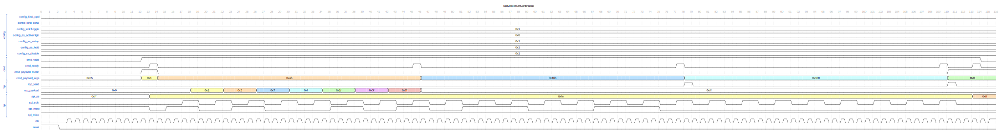

## SPI 控制器

> [!TIP]
> 这是一个用 spinalHDL 实现的 SPI 控制器，在 [SpiMasterCtrl](https://github.com/SpinalHDL/SpinalHDL/blob/dev/lib/src/main/scala/spinal/lib/com/spi/SpiMasterCtrl.scala) 的基础上进行了拓展，提供了两种使用方法，包括直接使用 IO 接口和用 amba 总线驱动，IO 接口方式没有变化，amba 总线加入了连续模式的控制

### IO 方式

#### Verilog 接口示例

```verilog
module SpiMasterCtrlContinuous (
  input  wire          io_config_kind_cpol,
  input  wire          io_config_kind_cpha,
  input  wire [7:0]    io_config_sclkToggle,
  input  wire [7:0]    io_config_ss_activeHigh,
  input  wire [7:0]    io_config_ss_setup,
  input  wire [7:0]    io_config_ss_hold,
  input  wire [7:0]    io_config_ss_disable,
  input  wire          io_cmd_valid,
  output reg           io_cmd_ready,
  input  wire [0:0]    io_cmd_payload_mode,
  input  wire [8:0]    io_cmd_payload_args,
  output wire          io_rsp_valid,
  output wire [7:0]    io_rsp_payload,
  output wire [7:0]    io_spi_ss,
  output wire          io_spi_sclk,
  output wire          io_spi_mosi,
  input  wire          io_spi_miso,
  input  wire          clk,
  input  wire          reset
);
```

#### IO 接口说明

| 名称                                  | 含义           | 备注                                                 |
| ------------------------------------- | -------------- | ---------------------------------------------------- |
| `input io_config_kind_cpol`           | 空闲时钟极性   | 0 低电平 1 高电平                                    |
| `input io_config_kind_cpha`           | 采样时钟沿     | 0 上升沿采样，下降沿移位，1 上升沿采样，下降沿移位   |
| `input [7:0] io_config_sclkToggle`    | 时钟分频       | sclk = FCLK / (2 \* (sclk_toggle + 1))               |
| `input [7:0] io_config_ss_activeHigh` | 片选有效极性   | 每个 bit 代表 ss 有效时的电平极性                    |
| `input [7:0] io_config_ss_setup`      | 片选建立时间   | 片选有效到下一个字节传输前的时钟周期数               |
| `input [7:0] io_config_ss_hold`       | 片选保持时间   | 最后一个字节传输完成到片段无效的时钟周期数           |
| `input [7:0] io_config_ss_disable`    | 片选无效时间   | 片选无效到片选有效的时钟周期数                       |
| `input io_cmd_valid`                  | 指令有效       |                                                      |
| `output io_cmd_ready`                 | 指令就绪       |                                                      |
| `input [0:0] io_cmd_payload_mode`     | 指令模式       | 0 数据模式 1 ss 模式-用于片选控制                    |
| `input [8:0] io_cmd_payload_args`     | 指令参数       | 根据指令模式分别代表了数据和读写，片选信号和片选有效 |
| `output io_rsp_valid`                 | 回复数据有效   |                                                      |
| `output [7:0] io_rsp_payload`         | 回复数据内容   |                                                      |
| `output [7:0] io_spi_ss`              | spi 片选       |                                                      |
| `output io_spi_sclk`                  | spi 时钟       |                                                      |
| `output io_spi_mosi`                  | spi 主设备输出 |                                                      |
| `input io_spi_miso`                   | spi 主设备输入 |                                                      |
| `input clk`                           | 模块时钟       |                                                      |
| `input reset`                         | 模块复位       |                                                      |

#### 仿真



- [仿真源码文件](./SpiMasterCtrl.scala#L213)
- [gtk 仿真波形 png 文件](../../../../../../timing/axispi/io_mode_wave.png)
- [gtk 仿真波形 fst 文件](../../../../../../timing/axispi/io_mode_wave.fst)

#### 自定义说明

- 生成配置

  `SpiMasterCtrlContinuous`的配置包含`generics`和`continuous`，后者仅在 bus 模式中有效

  ```scala
  case class SpiMasterCtrlGenerics( ssWidth : Int,
                                    timerWidth : Int,
                                    dataWidth : Int = 8){
    def ssGen = ssWidth != 0
  }
  ```

  `ssWidth`代表片选信号位宽，`timerWidth`代表了计数器位宽，主要为`io_config_ss_setup`, `io_config_ss_hold`, `io_config_ss_disable`, `io_config_sclkToggle`服务，`dataWidth`为数据位宽，一般为 8
  可通过如下代码生成

  ```scala
  val spi_ctrl = SpiMasterCtrlContinuous(SpiMasterCtrlGenerics(ssWidth = 8, timerWidth = 8, dataWidth = 8))
  ```

- 运行中配置

  根据[IO 接口说明](#io-接口说明),在传输前配置 config 对应接口

### amba 总线驱动

> [!TIP]
> 理论上实现了`BusSlaveFactory`的总线均可以，下面只讲 Axi4 接口

> [!WARNING]
> 需要注意的是，目前总线数据位宽仅支持 32 位，且 Axi4 实际接入的是 AxiLite4，需要进行一次 axi 的位宽转换，Axi4SpiMaster 已经实现了 AxiLite4 的转换，axi 位宽转换在 spinalHDL 没有合适的实现，可以采用 Xilinx 提供的 IP 核

#### Axi4 接口示例

```scala
case class Axi4SpiMaster(config: Axi4SpiMasterConfig) extends Component {
  val io = new Bundle {
    val s_axi = slave(Axi4(config.axiConfig))
    val m_spi = master(SpiMaster(config.spiConfig.ssWidth))
    val intr = out(Bool())
  }

  val spiMaster = SpiMasterCtrlContinuous(config.spiConfig, config.continuous)
  io.m_spi <> spiMaster.io.spi

  val axiLite = AxiLite4Utils.Axi4Rich(io.s_axi).toLite()

  val bus = AxiLite4SlaveFactory(axiLite)

  val bridge = spiMaster.io.driveFrom(bus = bus, baseAddress = 0)(generics =
    SpiMasterCtrlMemoryMappedConfig(
      config.spiConfig,
      config.cmdFifoDepth,
      config.rspFifoDepth
    )
  )
  io.intr := bridge.interruptCtrl.interrupt
  bus.printDataModel()

  noIoPrefix()
  Axi4SpecRenamer(io.s_axi)
}
```

- 配置

```scala
case class Axi4SpiMasterConfig(
    axiConfig: Axi4Config,
    spiConfig: SpiMasterCtrlGenerics,
    cmdFifoDepth: Int = 32,
    rspFifoDepth: Int = 32,
    continuous: Boolean = false,
)
```

`axiConfig`是对 axi 接口的配置，`spiConfig`和[IO 方式](#io-方式)一致，`cmdFifoDepth`和`rspFifoDepth`是指令和数据的 fifo 深度，是为了处理异步的 Axi 读写，`continuous`是为了配合驱动实现指令的连续发送

- 驱动

  - [驱动详情](../../../../../../driver/axispi/)

  ```log
  axispi
  ├── Makefile
  └── src
      ├── axispi.c
      ├── axispi.h
      └── types.h
  ```

  - [Makefile](../../../../../../driver/axispi/Makefile) - make 样例，实际使用根据项目的编译脚本替换
  - [src/axispi.c](../../../../../../driver/axispi/src/axispi.c) - axispi 源码文件，实现了控制函数
  - [src/axispi.h](../../../../../../driver/axispi/src/axispi.h) - axispi 头文件，提供结构定义和控制函数声明
  - [src/types.h](../../../../../../driver/axispi/src/types.h) - 提供类型定义和便捷使用的宏定义
